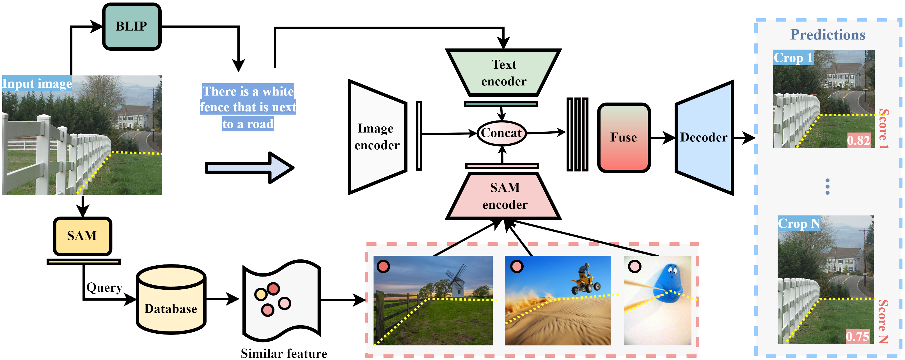

# ProCrop

Code for the AAAI 2026 paper: **ProCrop: Learning Aesthetic Image Cropping from Professional Compositions**

[](https://arxiv.org/abs/2505.22490)
[](https://github.com/BWGZK-keke/ProCrop)
[](https://huggingface.co/BWGZK/ProCrop)
[](https://huggingface.co/datasets/BWGZK/procrop_dataset)

<p align="center">
  
</p>

## Overview

ProCrop is a retrieval-augmented framework for aesthetic image cropping guided by professional photography compositions. Given a query image, ProCrop:

1. **Retrieves** compositionally similar professional images from a large database (AVA / CGL) using SAM embeddings and Faiss nearest-neighbor search.
2. **Fuses** retrieved features with the query via cross-attention.
3. **Predicts** diverse crop proposals ranked by aesthetic score using a Conditional DETR decoder.

ProCrop achieves state-of-the-art performance in both supervised (CPC, GAIC) and weakly-supervised (CAD dataset) settings.

## Repository Structure

```
ProCrop/
├── cropping/                    # Main ProCrop cropping module
│   ├── models/                  # ConditionalDETR + retrieval-augmented architecture
│   │   └── conditional_detr_cpc.py   # Core ProCrop model
│   ├── dataset/                 # Dataset loaders (CPC, GAIC, FLMS, SACD, CAD)
│   │   └── retrieval.py         # Retrieval table loader
│   ├── segment_anything/        # SAM utilities
│   ├── util/                    # Box ops and misc utilities
│   ├── engine.py                # GAIC training/eval loop
│   ├── engine_cpc.py            # CPC/FLMS training/eval loop
│   ├── main_ap.py               # Training entry point for GAIC / CAD
│   ├── main_cpc.py              # Training entry point for CPC / FLMS
│   └── test_singleimage.py      # Single-image inference
├── retrieval/
│   └── preprocess/
│       └── segment_anything/    # Full SAM model (for building retrieval indexes)
├── calculate_retrieval_relationships/   # Scripts to build top-k retrieval tables
├── requirements.txt
└── README.md
```

---

## Installation

```bash
conda create -n procrop python=3.11 -y
conda activate procrop
pip install -r requirements.txt
pip install git+https://github.com/openai/CLIP.git
```

---

## Datasets and Pretrained Models

### Pretrained checkpoint (HuggingFace)

The headline supervised checkpoint (FLMS IoU = **0.843**, matches paper Table 3) is available at:

🤗 **https://huggingface.co/BWGZK/ProCrop**

```python
from huggingface_hub import hf_hub_download
ckpt = hf_hub_download(repo_id="BWGZK/ProCrop", filename="procrop_flms_supervised.pth")
```

Or via CLI:
```bash
huggingface-cli download BWGZK/ProCrop procrop_flms_supervised.pth --local-dir ./checkpoints
```

### Dataset (HuggingFace)

Download from: https://huggingface.co/datasets/BWGZK/procrop_dataset

This includes:
- **CAD dataset** (weakly annotated images generated via ControlNet outpainting)
- **Precomputed retrieval tables** (`.pt` files mapping query images to top-32 AVA/CGL references)
- **Pre-extracted SAM embedding databases** (parquet format, for GAIC / FLMS / SACD evaluation)

### Additional downloads

**SAM ViT-B checkpoint** (for training on GAIC/CAD):
```bash
wget https://dl.fbaipublicfiles.com/segment_anything/sam_vit_b_01ec64.pth
```

**ConditionalDETR pretrained backbone** (`ConditionalDETR_r50dc5_epoch50.pth`):  
Download from [ConditionalDETR releases](https://github.com/Atten4Vis/ConditionalDETR).

---

## Step 1: Build Retrieval Relationships

> **Skip this step** if you downloaded the precomputed retrieval tables from HuggingFace.

The `calculate_retrieval_relationships/` directory contains scripts that compute top-k nearest-neighbor matches between query images and the professional image database using SAM embeddings + Faiss.

### Supported combinations

| Script | Query dataset | Retrieval database |
|--------|--------------|-------------------|
| `build_retrieval_relationship_GAICv2_ava.py` | GAIC | AVA (55K selected) |
| `build_retrieval_relationship_GAICv2_CPC.py` | GAIC | CPC |
| `build_retrieval_relationship_GAICv2_self.py` | GAIC | GAIC (self-retrieval) |
| `build_retrieval_relationship_GAICv2_Splash.py` | GAIC | Splash dataset |
| `build_retrieval_relationship_FCDB_ava.py` | FCDB | AVA |
| `build_relationship_GAICv1_self.py` | GAICv1 | GAIC (self-retrieval) |
| `build_retrieval_relationship_self.py` | CPC | CPC (self-retrieval) |

### How to run

1. Set the `data_dir` paths in the script to your embedding databases (parquet files with `sam_embeddings` column and a pre-built Faiss index).
2. Run the script:
```bash
python calculate_retrieval_relationships/build_retrieval_relationship_GAICv2_ava.py
```

The output is a `.pt` file that maps each query image filename to a list of top-k retrieved database image IDs. These `.pt` files are loaded at training/inference time by `cropping/dataset/retrieval.py`.

---

## Step 2: Training

All training scripts are in `cropping/`. Run them from inside the `cropping/` directory (or adjust imports accordingly).

### 2a. Train on CPC / FLMS (supervised)

```bash
cd cropping
python main_cpc.py \
    --dataset_root /path/to/CPCDataset \
    --retrieval_cache_dir /path/to/retrieval_tables \
    --output_dir ./output/cpc \
    --resume /path/to/ConditionalDETR_r50dc5_epoch50.pth \
    --batch_size 8 \
    --epochs 50 \
    --lr 1e-4 \
    --num_workers 4
```

**Key arguments:**

| Argument | Description |
|----------|-------------|
| `--dataset_root` | Root of CPCDataset (with `images/` and `CollectedAnnotationsRaw/`) |
| `--retrieval_cache_dir` | Dir containing the `.pt` retrieval tables from Step 1 |
| `--resume` | ConditionalDETR pretrained checkpoint |
| `--good_thresh` | Score threshold for positive crops (default: 2.0) |

### 2b. Train on GAIC / CAD dataset (weakly supervised)

```bash
cd cropping
python main_ap.py \
    --dataset_root /path/to/CAD_or_GAIC \
    --retrieval_db_root /path/to/embedding_databases \
    --ava_root /path/to/AVA/images/train \
    --sacd_root /path/to/SACD \
    --fcdb_root /path/to/FCDB \
    --sam_checkpoint /path/to/sam_vit_b_01ec64.pth \
    --output_dir ./output/gaic \
    --resume /path/to/ConditionalDETR_r50dc5_epoch50.pth \
    --batch_size 4 \
    --epochs 120 \
    --lr 1e-4
```

**Key arguments:**

| Argument | Description |
|----------|-------------|
| `--dataset_root` | Root of CAD (synthetic) or GAIC training dataset |
| `--retrieval_db_root` | Root dir for SAM embedding databases (see structure below) |
| `--ava_root` | AVA images directory (used as retrieval key prefix) |
| `--sacd_root` | SACD dataset root (with `images/` and `annotations/`) for validation |
| `--fcdb_root` | FCDB dataset root (with `images/` and `annotations/`) for validation |
| `--sam_checkpoint` | SAM ViT-B checkpoint path |

### Embedding database structure

`--retrieval_db_root` should contain HuggingFace-format parquet files (downloadable from HuggingFace):

```
retrieval_db_root/
├── ava_self_correlated/
│   └── train/
│       └── *.parquet    # AVA images: sam_embeddings + retrieved_names columns
├── ava_synthetic/
│   └── train/
│       └── *.parquet
├── ava_flms_fcdb/
│   └── train/
│       └── *.parquet
└── ava_sacd/
    └── train/
        └── *.parquet
```

---

## Step 3: Evaluation

Evaluation runs automatically every epoch during training. To evaluate a saved checkpoint:

### CPC / FLMS evaluation

```bash
cd cropping
python main_cpc.py \
    --dataset_root /path/to/CPCDataset \
    --retrieval_cache_dir /path/to/retrieval_tables \
    --resume /path/to/checkpoint.pth \
    --eval
```

### GAIC evaluation

```bash
cd cropping
python main_ap.py \
    --dataset_root /path/to/GAIC \
    --retrieval_db_root /path/to/embedding_databases \
    --ava_root /path/to/AVA/images/train \
    --sacd_root /path/to/SACD \
    --fcdb_root /path/to/FCDB \
    --sam_checkpoint /path/to/sam_vit_b_01ec64.pth \
    --resume /path/to/checkpoint.pth \
    --eval
```

---

## Step 4: Single-Image Inference

```bash
cd cropping
python test_singleimage.py \
    --dataset_root /path/to/images \
    --retrieval_cache_dir /path/to/retrieval_tables \
    --retrieval_img_dir /path/to/CGL_images \
    --resume /path/to/checkpoint.pth \
    --crop_savepath ./results
```

---

## Model Architecture

ProCrop extends **Conditional DETR** with a retrieval augmentation module:

1. **Backbone**: ResNet-50 extracts multi-scale features from the query image.
2. **Transformer Encoder**: Processes spatial features from the backbone.
3. **Retrieval**: SAM embeddings (64×256) are fetched from precomputed tables; they represent structural compositions of top-K professional reference images.
4. **Fusion**: Retrieved embeddings are projected and fused with query features via **cross-attention**.
5. **Decoder**: Transformer decoder with N=24 learnable queries generates crop proposals.
6. **Heads**: Two MLP heads predict bounding boxes and aesthetic quality scores.
7. **Loss**: Binary focal loss with soft labels (from crop quality scores) + L1 + GIoU regression loss.
8. **EMA Self-distillation**: Mean-teacher framework for weakly-supervised training on CAD.

Core model: [`cropping/models/conditional_detr_cpc.py`](cropping/models/conditional_detr_cpc.py)

---

## CAD Dataset

The Composition-Aware Dataset (CAD) contains 242K weakly annotated training images:
- Generated by outpainting high-quality crops (from AVA / FLMS) using ControlNet
- Each image has a pseudo-label for the original crop region as the "good crop"
- Iteratively refined using the trained ProCrop model

Download from HuggingFace: https://huggingface.co/datasets/BWGZK/procrop_dataset

---

## Citation

```bibtex
@inproceedings{zhang2026procrop,
  title={Procrop: Learning aesthetic image cropping from professional compositions},
  author={Zhang, Ke and Ding, Tianyu and Jiang, Jiachen and Chen, Tianyi and Zharkov, Ilya and Patel, Vishal M and Liang, Luming},
  booktitle={Proceedings of the AAAI Conference on Artificial Intelligence},
  volume={40},
  number={15},
  pages={12600--12608},
  year={2026}
}
```

---

## Acknowledgements

This codebase builds on:
- [ConditionalDETR](https://github.com/Atten4Vis/ConditionalDETR) — transformer-based crop proposal backbone
- [RALF](https://github.com/CyberAgentAILab/RALF) — retrieval-augmented layout generation framework (adapted for cross-dataset retrieval)
- [SAM](https://github.com/facebookresearch/segment-anything) — image embeddings for retrieval similarity
- [DreamSim](https://github.com/ssundaram21/dreamsim) — perceptual similarity metric for retrieval indexing
